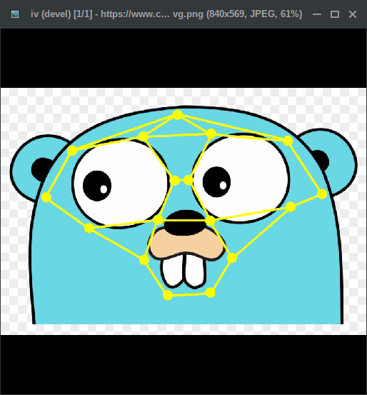

## iv
[](https://github.com/gen2brain/iv/actions)
[](https://pkg.go.dev/github.com/gen2brain/iv)

Small and simple image viewer.



### Features

* Supports Linux (X11, Wayland, DRM), Windows (Win32), macOS (Cocoa) and BSDs (X11)
* Supports JPEG, GIF, PNG, BMP, WEBP, AVIF, JXL, HEIC, ICO, PCX, TIFF, PNM, PBM, PGM, PPM, SVG, PSD, PSP, MPO and QOI
* Supports HTTP URL arguments (if URL is an HTML page, it will scrape images)
* Supports animated GIF, PNG, WEBP, AVIF and JXL
* Reloads automatically when the current image is modified or its directory changes
* Single instance mode, open files in an already-running window
* No external runtime dependencies, single static binary \*
 
### Download

Download the latest binaries from the [releases](https://github.com/gen2brain/iv/releases).

\* Release binaries use `CGO_ENABLED=0`; Linux/BSD binaries are built with `nodynamic` tag (no libc).
Note that without `nodynamic` even with `CGO_ENABLED=0` the binary will still link to libc.

### Installation

`go install github.com/gen2brain/iv/cmd/iv@latest`

This command will install `iv` in `GOBIN`, you can point `GOBIN` to e.g. `/usr/local/bin` or `~/.local/bin`.
Add `-ldflags "-s -w"` to strip debug symbols.

### Build tags

* `minimal` - build support only for JPEG, GIF and PNG (stdlib only)
* `nodynamic` - decode WEBP, AVIF, JXL and HEIC with Go decoders instead of the system shared libraries (`libwebp`, `libavif`, `libjxl`, `libheif`)
* `x11` - use X11 in macOS or Windows (e.g., via [XQuartz](https://en.wikipedia.org/wiki/XQuartz) or [Xming](https://en.wikipedia.org/wiki/Xming))

### Keybindings

*Next image*
* `j` / `Right` / `Space` / `Scroll Down`

*Previous image*
* `k` / `Left` / `BackSpace` / `Scroll Up`

*Toggle Fullscreen*
* `f` / `F11` / `Double-click`

*Toggle Slideshow*
* `s`

*Go 10 images back*
* `[` / `PageUp`

*Go 10 images forward*
* `]` / `PageDown`

*Go to the first image*
* `,` / `Home`

*Go to the last image*
* `.` / `End`

*Jump to image number*
* `<number>` then `G` (e.g. `12G`)

*Zoom In, Zoom Out, Original Size, Fit*
* `+` / `Ctrl+Scroll Up`, `-` / `Ctrl+Scroll Down`, `Shift+9`, `Shift+0`

*Adjust Contrast*
* `Shift+1`, `Shift+2`

*Adjust Brightness*
* `Shift+3`, `Shift+4`

*Adjust Gamma*
* `Shift+5`, `Shift+6`

*Adjust Saturation*
* `Shift+7`, `Shift+8`

*Rotate (clockwise / counterclockwise)*
* `r` / `Shift+r`

*Flip (horizontal / vertical)*
* `h` / `v`

*Quit*
* `q` / `Escape`

*Print current image path to stdout*
* `Enter`

### Examples

* View all images in a directory

    `iv /media/images/`

* View all JPEGs in all subdirectories

    `find . -iname "*.jpg" | iv`

* Delete current image when enter is pressed

    `iv *.jpg | xargs rm -f`

* Rotate the current image when enter is pressed

    `iv *.jpg | xargs -i convert -rotate 90 {} {}`

### Usage
```
Usage: iv [<flags>] [file1 dir1 url1 ... fileOrDirN]
  --width
    	Window width [IV_WIDTH]. (default "1024")
  --height
    	Window height [IV_HEIGHT]. (default "768")
  --device
    	DRM device index [IV_DEVICE]. (default "0")
  --filter
    	0=NearestNeighbor, 1=Linear, 2=Bicubic [IV_FILTER]. (default "0")
  --title
    	Show window title [IV_TITLE]. (default "true")
  --slideshow
    	Start slideshow [IV_SLIDESHOW]. (default "false")
  --slideshow-interval
    	Slideshow interval (in seconds) [IV_SLIDESHOW_INTERVAL]. (default "4")
  --recursive
    	Process subdirectories recursively [IV_RECURSIVE]. (default "false")
  --fullscreen
    	Start in fullscreen [IV_FULLSCREEN]. (default "false")
  --browse
    	Load all images from the image directory [IV_BROWSE]. (default "true")
  --loop
    	Wrap around at the first/last image [IV_LOOP]. (default "false")
  --sort
    	0=No sort, 1=Name (natural order), 2=Modification time, 3=Size, 4=Shuffle [IV_SORT]. (default "0")
  --text-color
    	Text color [IV_TEXT_COLOR]. (default "#FFFFFF")
  --background-color
    	Window background color [IV_BACKGROUND_COLOR]. (default "#000000")
  --zoom
    	Initial zoom level (1, 1000) [IV_ZOOM]. (default "0")
  --contrast
    	Adjust contrast (-100, 100) [IV_CONTRAST]. (default "0")
  --brightness
    	Adjust brightness (-100, 100) [IV_BRIGHTNESS]. (default "0")
  --gamma
    	Adjust gamma (1, 100) [IV_GAMMA]. (default "100")
  --saturation
    	Adjust saturation (-100, 100) [IV_SATURATION]. (default "0")
  --single
    	Single instance; send files to a running window [IV_SINGLE]. (default "false")
  --wait
    	Open a blank window and wait for images (use with --single) [IV_WAIT]. (default "false")
```

On Linux, you can also use `IV_DRIVER` env var, i.e. `IV_DRIVER=x11` will force X11 compatibility mode on Wayland.
To use a config file, create file `$XDG_CONFIG_HOME/iv/config`, see [example](cmd/iv/resources/config.example).

### Library usage
```
runtime.LockOSThread()

view, err := iv.New()
if err != nil {
    panic(err)
}

view.Display(context.Background(), img)
```
